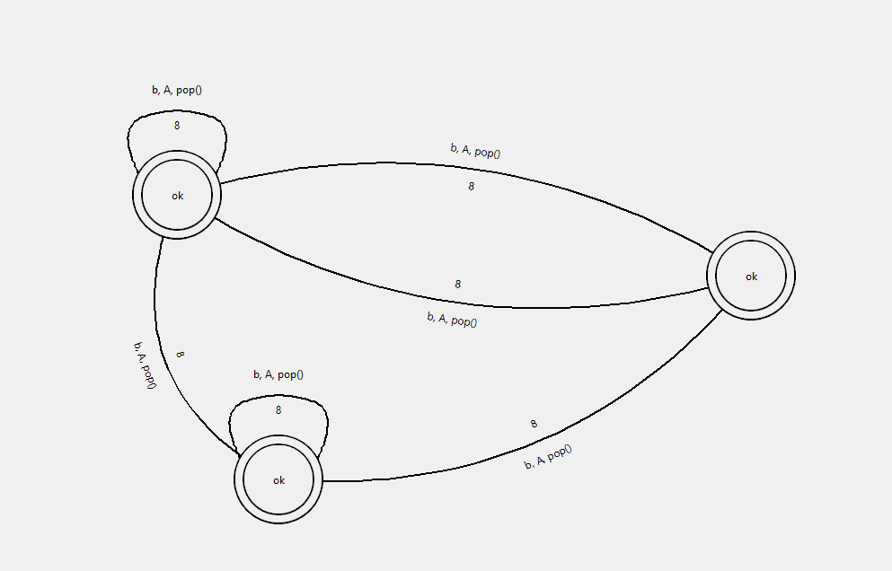

# tk-netgraph
tk-netgraph is a powerful graph engine for tkinter that prioritizes modularity and customization. It is 
currently in a WIP-state and actively maintained.

The following features are supported right now:
- Multigraphs (multiple edges with the same endpoints)
- self-loops (edges that connect a node to itself)
- Labeled and weighted edges
- Labeled nodes
- Dragging of nodes
- Dragging of graph components or the whole graph
- Dynamic edge creation by clicking on nodes
- Cheap antialiased circles/lines (wip)
- Reactive appearance configuration

Missing:
- support for directed edges
- API is missing some abstract components
- support for draggable edge line points

# Examples:
Examples can be found in the [examples folder](examples/)

